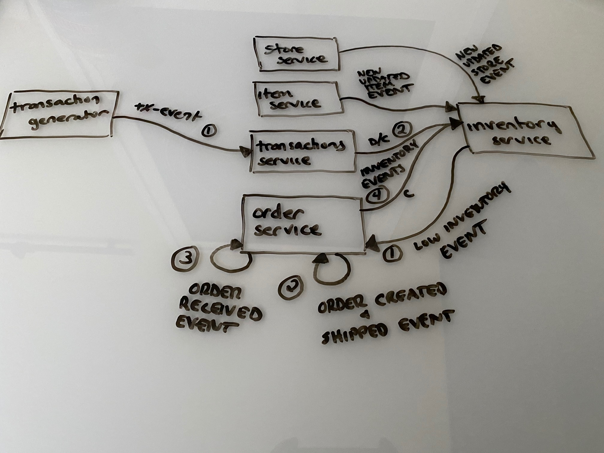

# kafka-examples

## Overview

The examples in this repository represent a simple store and inventory domain.  The application consists of a store-service, item-service, inventory-service, transaction-service, and a common events library.  The high level architecture and event flow is shown here.

The description of each of these services can be found in the Services section below.  The in-depth details can be found in the README for each service.

## Prerequisites

Currently, the services listed above require a few external prerequisites:

* Kafka instance or cluster
* PostgreSQL instance
* Mongo DB instance

Each of the setups will be discussed in the README for each service.

## Services

Below is a high level description of each project.  See the associated README for more details.

### Store Service

The store service is designed to manage store resources and offers all of the associated CRUD operations.

### Item Service

The item service is designed to manage item resources and offers all of the associated CRUD operations.  These would be items that would be available for sale in the stores.

### Inventory Service

The inventory manages the inventory of the items in each store.

### Transaction Service

The transaction service will automatically generate random sales events to be used by the inventory service to update inventory counts.

### Store Events

This library just contains the Events that will be generated and consumed from the Kafka topics and the associated Kafka Serializer/Deserializers.  These Events and Serializer/Deserializer classes will be reused across services to maintain consistent interfaces.

